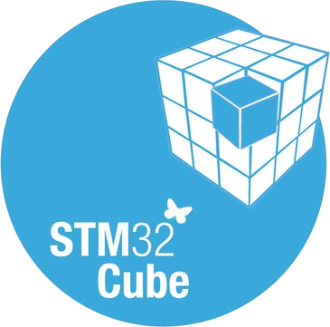

### Hi there 👋

 My full name is `Chau Ngoc Tinh`, but my friends often call me `Tinh Chau` or... `Tenh Chu`.

- 🎓 I'm studying at HCM University of Technology.
- 🌱 I’m currently learning Electronics and Telecommunication.
- ⚡ Fun fact: trying to go from failure engineer to the greatest technician that ever lived.

<h4 align="left">Languages:</h4>

  

<h4 align="left">Tools:</h4>

&nbsp&nbsp
&nbsp&nbsp
 
<a href="https://git-scm.com/" target="_blank" rel="noreferrer">&nbsp&nbsp
 </a>
<a href="https://git-scm.com/" target="_blank" rel="noreferrer">&nbsp&nbsp
 </a>
<a href="https://git-scm.com/" target="_blank" rel="noreferrer">&nbsp
 </a>

|||
|---|---|